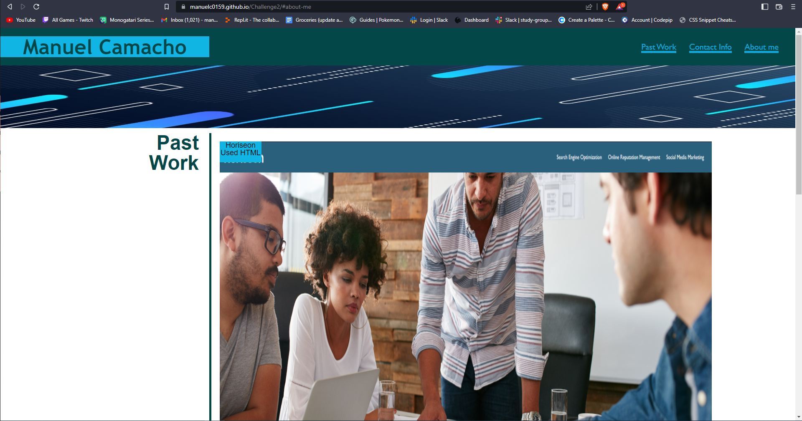

# Challenge2
This is the second challenge in the bootcamp

Made a portfolio with all my projects (1) up to this point. Had to make sure the website had clickables that will take you to each section on the site. website needed to have a picture of me as well as contact info. I added some transitions and tested a lot of different things out to try and make it look as good as I can. Since I did not have more than 1 project, I added placeholders so in the future I could easily add projects there. For the most part I tried to test and have fun with it, see what I could do.

https://manuelc0159.github.io/Challenge2/#about-me

